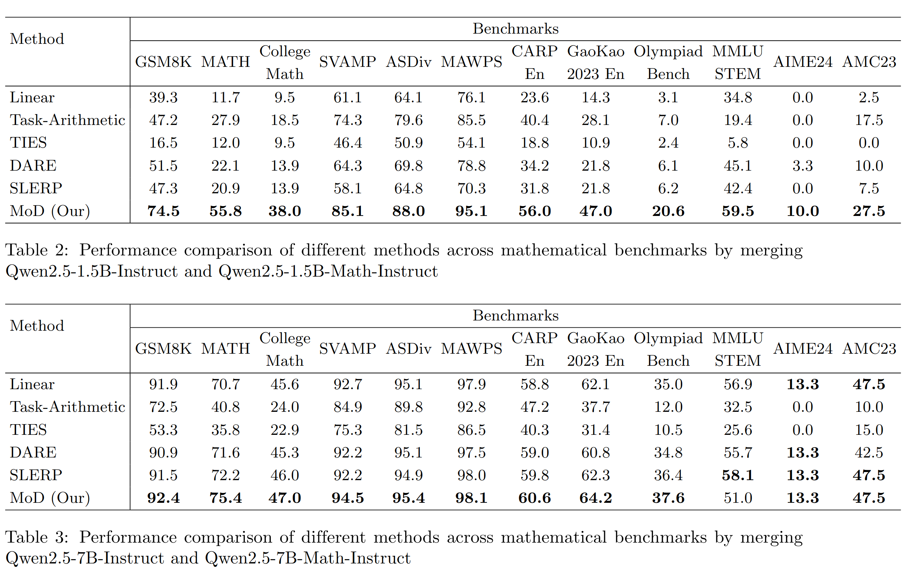

# Mixture of Distributions - Evaluation

This repository contains the code and evaluation scripts for the paper [MoD: A Distribution-Based Approach for Merging Large Language Models](https://arxiv.org/abs/2411.00406).



## Setup 

### 1. Clone Repository and Install Requirements

Start by cloning the repository and setting up a virtual environment:

```bash
git clone https://github.com/knovel-eng/mod-evaluate.git
cd mod-evaluate
python -m venv venv
source venv/bin/activate
pip install --upgrade pip
pip install -r requirements.txt
```

### 2. Set Up Experiments

To prepare the experiments, clone the necessary dependencies and set up additional modules:

```bash
# Clone Qwen2.5-Math and copy shell scripts for evaluation
git clone https://github.com/QwenLM/Qwen2.5-Math.git
cp -r sh/ Qwen2.5-Math/evaluation/

# Clone the main MoD repository
cd Qwen2.5-Math/
git clone https://github.com/knovel-eng/mod.git

# Navigate to the latex2sympy folder and install dependencies
cd evaluation/latex2sympy
pip install -e .

# Install remaining dependencies
cd ..
pip install -r requirements.txt 
pip install vllm==0.5.1 --no-build-isolation
pip install transformers
```

## Running Experiments

To run evaluations for different model configurations, execute the following shell scripts:

```bash
sh sh/run_eval_qwen2_1.5_math.sh
sh sh/run_eval_qwen2_7_math.sh
```